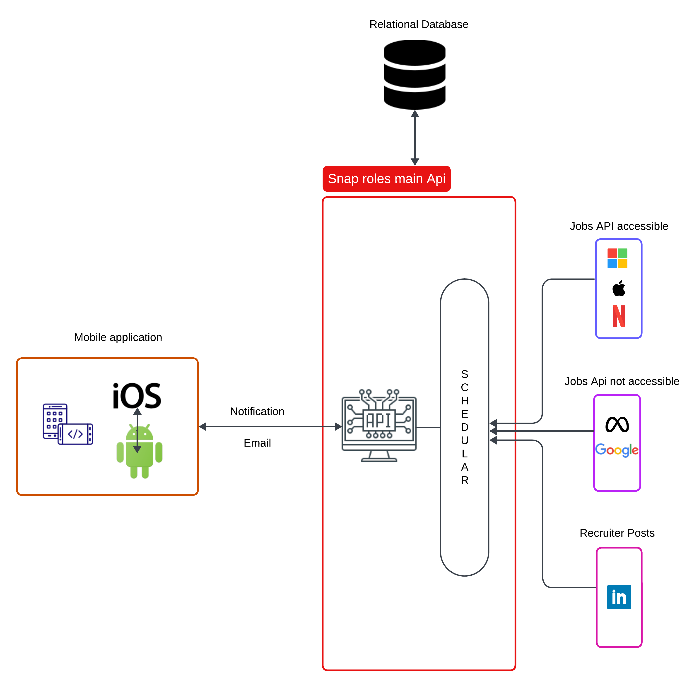

# Snap Roles

## Introduction
This is 2023, and the economic condition isn't very great now. All the students are working hard to secure atleast one intern or FTE (full time employment) jobs. The situation are kinda hard now, not like previous batch where everyone had a few offers to decide upon. Students are corssing 500-600 job application mark and still finding hard to secure even interview, leave getting an offer. The amount of students applying are humangous and top companies has limited jobs. The application pool is filling fast, as soon as in few hours after posting the jobs, due to sheer volume of students applying. And out of these thousands who were able to see those jobs, only few manages to get resume selected.
So the main problem for students is getting timely information about the company's relevant job. And here this application comes to rescue=.

The aim of this program was to give instant information about Recent Grad/ Intern posting, mainly 10-15 minues of latency after a job posting. The program relies on Official APIs from company to get the accurate data.

The goal was to make two system for informing students about the newly added jobs:
- A mobile application
- Email notification

## Architecture Diagram



## How it will work?
We have a lot of companies which don't have proper authentication system for their career site for listing jobs, due to many reasons. Thus I aim to utilize these freely available apis to get instant information about jobs posted, directly from the official website itself. Without relying on external sites like linkedin, or indeed, where recruiters post multiple jobs again and agian. 
This helps in getting timely and correct information from the source itself.
i have implemented a schedular which check the Apis in every 15 minutes, thus giving the overall latency of 15m minutes obly. So, students will be able to get the job information as soon as 15 minutes of it being posted.
Now, there are tons of companies and they follow different api contracts and authentication methods for thier site. I thought of robust system to incorporate all the companies.
So microsoft has very good job's api, in wihch they return the timestamp of the job as well. But for apple, they just return date of the job posted, thus we will have to store each job Id and compare with past schedular iterations. This way we will be able to get jobs posted in last 15 minutes.
Please note, scheduling time of 15 minutes was taken to reduce the number of API calls to the servers and at the same time giving robust timely updates to candidates, this time can be changed according to convinience.

For companies like meta, they use highly authenticated services which can't be used to access useful information about the jobs. For these types of companies, the only way is web scrapping, we can apply the same schedular, but this time on web scrapper to get latest jobs.

Now various companies initially open a generic positions for all the teams and divide candidates to them. Additioannly, some manager of a known company or even unknown company (here known companies are those for which the schedular is working to get data) might post job opportuinities on linkedin itself. But they're highly irrelavant, because they mainly include consultancy. For those types of companies, we can scrap data from linkedin posts (or even use Linkedin Posts api depending upon the guidelines). 


## Prerequisites: 
- Go needs to be installed; 
- The following commands are being executed in the root folder.

## Running

run this command to run swagger init and running (bulding) the server
```
make swag_run
```

run this command to clean the solution and remove the binaries
```
make clean
```

## Folder Structure 
```
|-- snap_roles
   |-- cmd
      |-- .DS_Store
      |-- model
         |-- dbModel.go
         |-- microsoftResponse.go
      |-- api
         |-- main.go
      |-- pkg
         |-- db
            |-- azure_sql.go
         |-- api
            |-- routers
               |-- router.go
            |-- company_api.go
            |-- controller
               |-- jobs_controller.go
            |-- helper
               |-- helper.go
            |-- handlers
               |-- requests_handler.go
   |-- go.mod
   |-- .DS_Store
   |-- stage.env
   |-- Makefile
   |-- internal
      |-- .DS_Store
      |-- constants
         |-- construct_json_response.go
         |-- constant.go
   |-- go.sum
   |-- docs
      |-- swagger.yaml
      |-- docs.go
      |-- swagger.json
   |-- README.md
   |-- .gitignore
   |-- configs
      |-- config.go
   |-- .vscode
      |-- launch.json
   |-- assets
      |-- .DS_Store
      |-- images
         |-- Blank board.png
```


